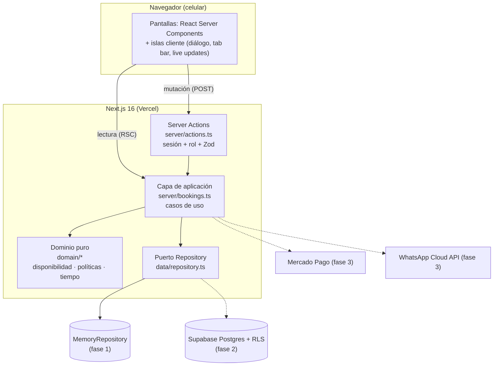
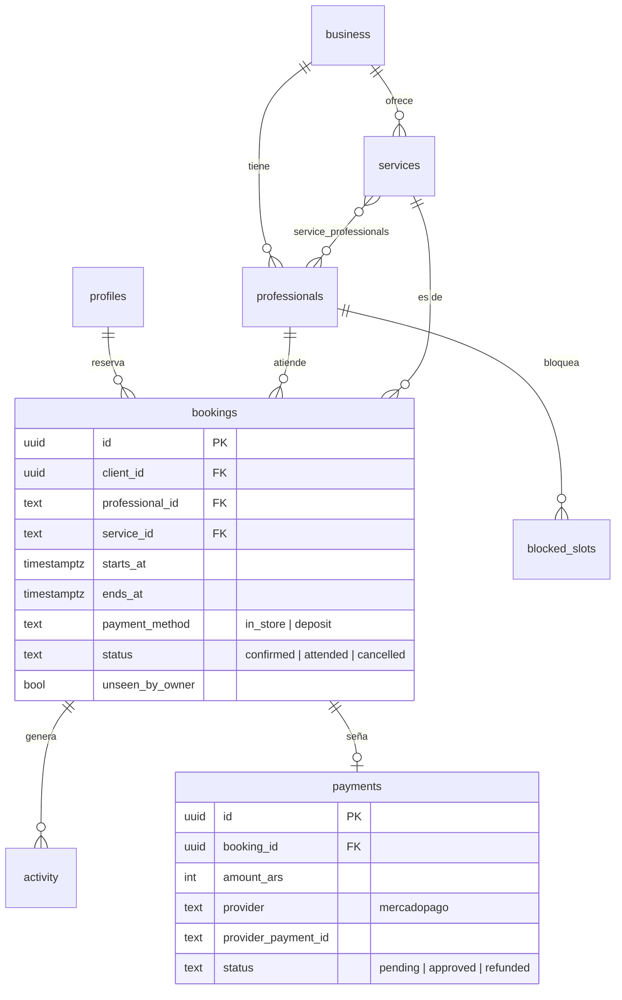

# Arquitectura

## Visión general

### Capas y reglas de dependencia

| Capa             | Carpeta                     | Puede importar    | Responsabilidad                                                                                                                    |
| ---------------- | --------------------------- | ----------------- | ---------------------------------------------------------------------------------------------------------------------------------- |
| **Dominio**      | `src/domain`                | nada del proyecto | Tipos y reglas puras: grilla de horarios, superposición, primer libre, seña, política de 24 h, formato de fechas. 100 % testeable. |
| **Datos**        | `src/data`                  | dominio           | Catálogo, seed, interfaz `Repository` y sus implementaciones.                                                                      |
| **Aplicación**   | `src/server`                | dominio, datos    | Casos de uso (`createBooking`, `cancelByClient`…), sesión y Server Actions. Marcado con `server-only`.                             |
| **Presentación** | `src/app`, `src/components` | todo lo anterior  | Pantallas y componentes. Nunca acceden al repositorio directamente.                                                                |

Las dependencias apuntan **hacia adentro**: cambiar la base de datos o el
framework no toca las reglas de negocio (arquitectura hexagonal / _ports & adapters_).

---

## Decisiones (ADR resumidos)

### ADR-001 · Next.js con App Router y Server Components

**Contexto:** clientes en celulares de gama media y redes móviles; equipo chico.
**Decisión:** Next.js 16 con RSC. Las pantallas se renderizan en el servidor y
solo se envía JS para lo interactivo (diálogo, tab bar, avisos en vivo).
**Consecuencias:** menos JS en el cliente, un solo repo y deploy; hay que
cuidar qué se pasa de Server a Client Components (solo datos serializables).

### ADR-002 · El estado del flujo de reserva vive en la URL

**Decisión:** `?servicio=…&profesional=…&fecha=…&hora=…&pago=…`, validado con Zod.
**Por qué:** "atrás" del navegador funciona, se puede recargar o compartir,
las pantallas no tienen estado y funcionan sin JS.
**Alternativa descartada:** store global en el cliente (se pierde al recargar, más JS).

### ADR-003 · Repository como puerto de persistencia

**Decisión:** la app depende de la interfaz `Repository`. Fase 1: `MemoryRepository`; fase 2: `SupabaseRepository`.
**Por qué:** se pudo construir y validar toda la UX sin infraestructura, y migrar será cambiar una línea en `server/bookings.ts`.

### ADR-004 · Doble defensa contra turnos superpuestos

**Decisión:** (1) la confirmación revalida la disponibilidad dentro de una
transacción y (2) en Postgres una restricción `EXCLUDE USING gist` impide dos
turnos activos superpuestos del mismo profesional.
**Por qué:** la revalidación da un mensaje amable; la restricción garantiza la
integridad aunque haya concurrencia real o un bug.

### ADR-005 · Server Actions como única vía de mutación

**Decisión:** toda escritura pasa por `server/actions.ts`, que en cada acción:

1. verifica sesión **y rol**, 2) valida con Zod, 3) delega en el caso de uso.
   **Por qué:** las Server Actions son endpoints POST públicos; nunca se confía en
   el formulario. Los chequeos de propiedad ("¿el turno es de este cliente?") y de
   política (24 h) se repiten en el servidor aunque la UI ya los aplique.

### ADR-006 · Horas como "minutos del día" en la zona del local

**Decisión:** fechas `YYYY-MM-DD` + minuto del día, siempre en
`America/Argentina/Buenos_Aires`. En la base se guarda además `starts_at timestamptz`.
**Por qué:** la lógica de grilla es aritmética simple y no depende de la zona
horaria del servidor (Vercel corre en UTC).

### ADR-008 · Ingreso sin contraseña para clientes

**Decisión:** celular + código de un solo uso para clientes; email + contraseña para la dueña.
**Por qué:** el cliente usa la app pocas veces al mes y su identidad para el local ya es el teléfono (WhatsApp); una contraseña sería fricción y soporte. La dueña accede a datos de todos los clientes, así que usa un factor clásico y sesión corta.
**Fase 2:** Supabase Auth con OTP por SMS/WhatsApp (cliente) y email + contraseña con recuperación (dueña); solo cambian `server/session.ts` y `server/auth-actions.ts`.

### ADR-007 · Actualización en vivo por polling (fase 1) → Realtime (fase 2)

**Decisión:** `router.refresh()` cada 15 s y al volver a la pestaña. En la fase 2
se reemplaza por una suscripción de Supabase Realtime a `activity`.

---

## Modelo de datos

El SQL completo, con restricciones, índices y políticas RLS, está en
[`supabase/migrations/20261005000000_init.sql`](../supabase/migrations/20261005000000_init.sql).

---

## Seguridad

| Riesgo                                    | Mitigación                                                                                                                                                      |
| ----------------------------------------- | --------------------------------------------------------------------------------------------------------------------------------------------------------------- |
| Sesiones falsificadas                     | Cookie `httpOnly`, `SameSite=Lax`, `Secure` en producción y firmada con HMAC-SHA256 (`server/signed-cookie.ts`), con vencimiento propio.                        |
| Fuerza bruta en el código de ingreso      | 6 dígitos aleatorios (`crypto.randomInt`), solo se guarda el hash, vence en 5 min, 5 intentos y reenvío cada 30 s.                                              |
| Fuerza bruta en la contraseña de la dueña | Comparación en tiempo constante, mensaje de error genérico y bloqueo de 15 min tras 5 fallos.                                                                   |
| Secretos en producción                    | `SESSION_SECRET`, `OWNER_EMAIL` y `OWNER_PASSWORD` validados con Zod; si faltan, el login falla (falla cerrada). `.env.development` solo tiene datos de prueba. |
| Llamar Server Actions directamente        | Sesión + rol + Zod en cada acción (`server/actions.ts`).                                                                                                        |
| Cliente modificando turnos ajenos         | Chequeo de `clientId` en el caso de uso; en Supabase, RLS `client_id = auth.uid()`.                                                                             |
| Dueña = rol privilegiado                  | Rol en `profiles.role`; políticas RLS de escritura solo para `owner`.                                                                                           |
| Datos personales (teléfonos)              | Solo visibles para la dueña; nunca en URLs ni logs.                                                                                                             |
| Código de servidor filtrado al cliente    | `import "server-only"` en repositorio, sesión y casos de uso.                                                                                                   |
| Pagos falsificados                        | La seña se confirma únicamente por webhook firmado de Mercado Pago, nunca desde el navegador.                                                                   |
| Secretos                                  | Variables de entorno (`.env.local`, no versionado); ver `.env.example`.                                                                                         |

---

## Calidad y CI

- **TypeScript estricto** y tipos generados de rutas (`PageProps<"/ruta">`).
- **Tests unitarios** del dominio con Vitest (`npm test`): grilla, cierres, superposición, bloqueos, "cualquiera", reprogramación, seña, política de 24 h, zona horaria.
- **GitHub Actions** (`.github/workflows/ci.yml`): lint → typecheck → test → build en cada push y PR.
- **Próximo:** tests E2E con Playwright de los dos flujos principales y auditoría de accesibilidad con `@axe-core/playwright`.

---

## Migración a Supabase (fase 2), paso a paso

1. Crear el proyecto y aplicar la migración (`supabase db push`).
2. Implementar `src/data/supabase-repository.ts` que cumpla `Repository` (usar `@supabase/ssr`).
3. En `src/server/bookings.ts`, cambiar `getMemoryRepository` por el nuevo repositorio.
4. Reemplazar `getSession()` en `src/server/session.ts` por la sesión de Supabase Auth (cliente: OTP por teléfono; dueña: email + contraseña) leyendo `profiles.role`.
5. Reemplazar el polling de `live-updates.tsx` por Supabase Realtime.
6. Cargar las variables de `.env.example` en Vercel.
