# User flows

Flujos de cada rol tal como están implementados. Los nombres de pantalla
coinciden con las rutas de `src/app`.

## Mapa de pantallas

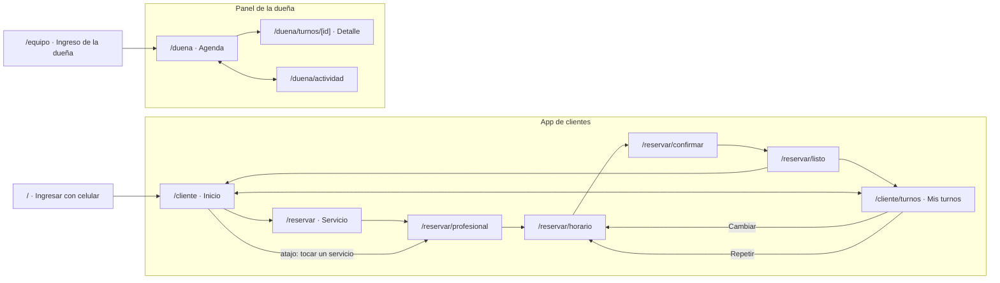

---

## Ingreso

### Cliente: celular + código (sin contraseña)

**Por qué así:** el cliente entra pocas veces al mes; una contraseña más es
fricción y se olvida. El celular ya es su identidad para el local (WhatsApp).

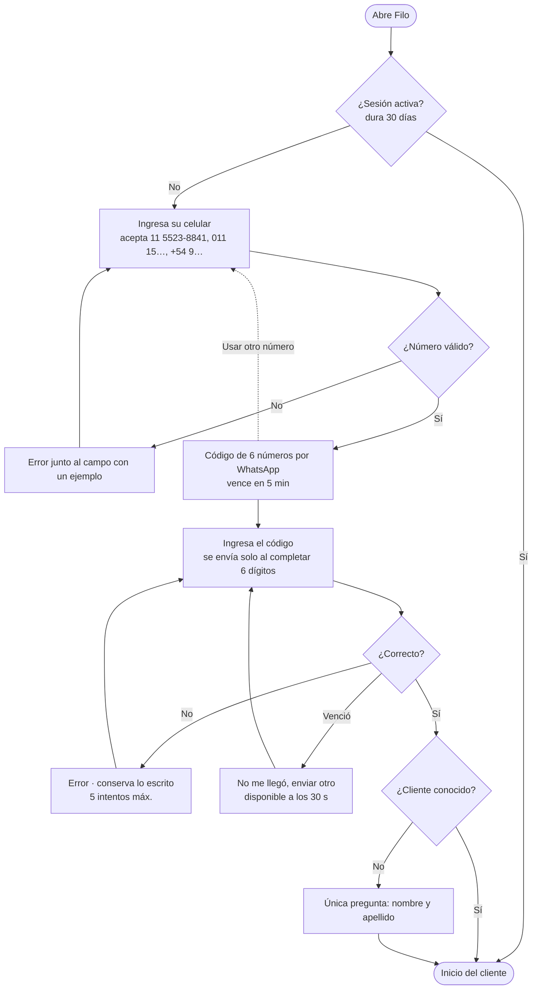

### Dueña: email + contraseña

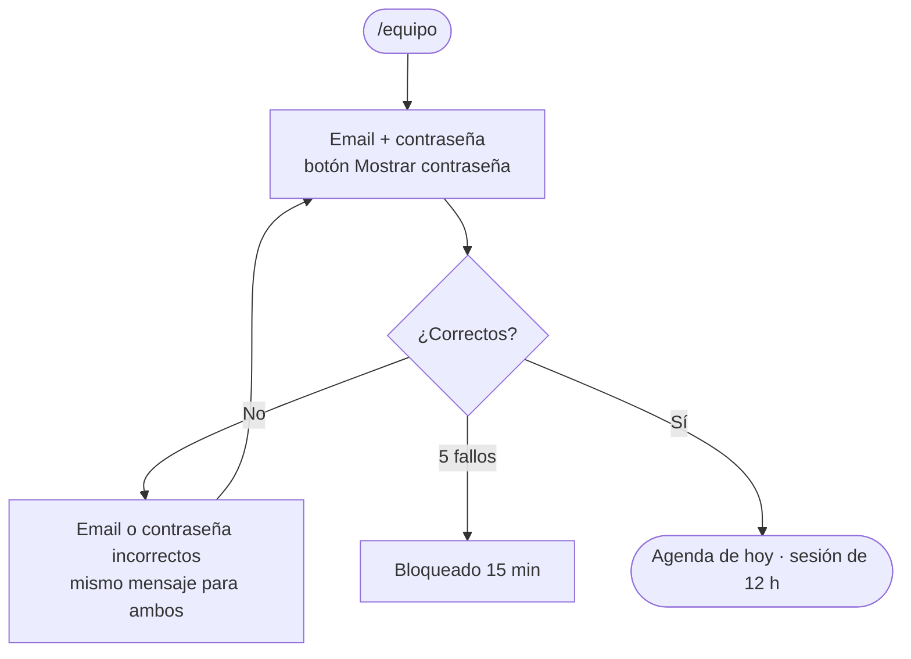

---

## Cliente

### 1. Reservar un turno (camino feliz)

**Objetivo:** turno confirmado en menos de 60 segundos y 4 decisiones.

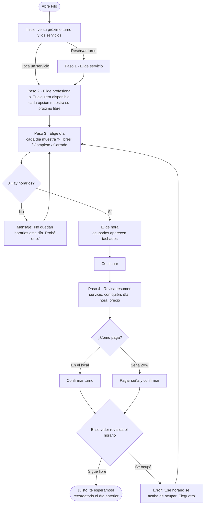

### 2. Cambiar un turno

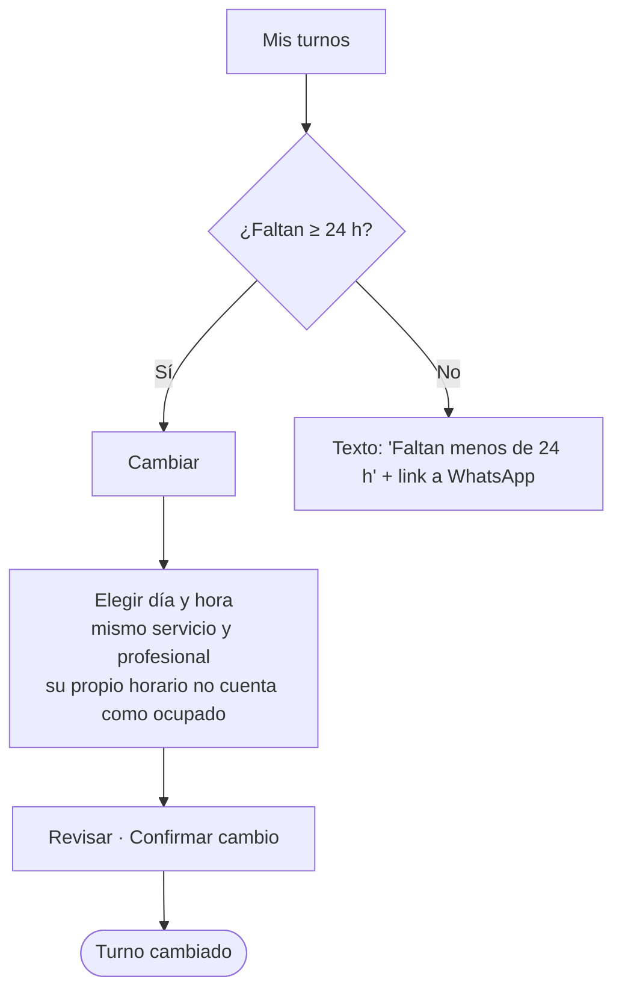

### 3. Cancelar un turno

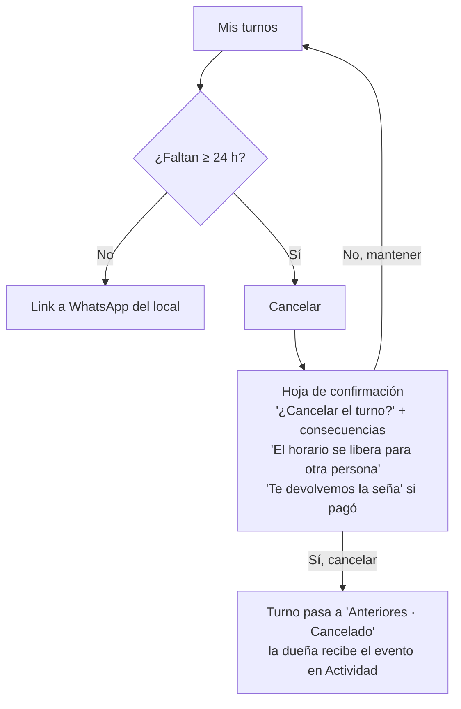

### 4. Repetir un servicio

Desde **Mis turnos → Anteriores → Repetir**, el cliente salta directo al paso 3
con el mismo servicio y profesional: reservar lo de siempre lleva 2 toques.

---

## Dueña

### 1. Revisar el día

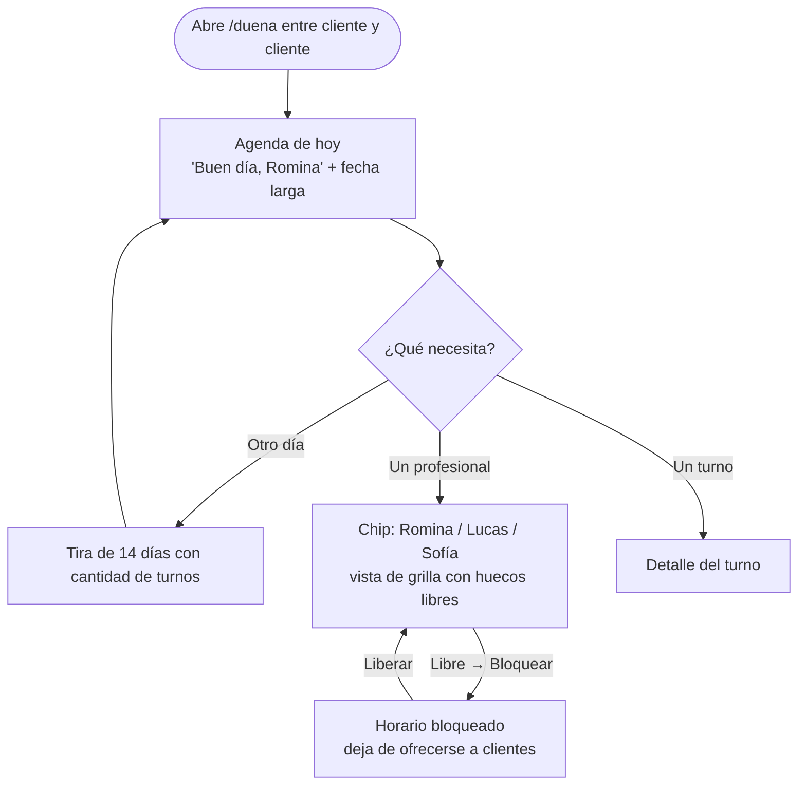

### 2. Gestionar un turno

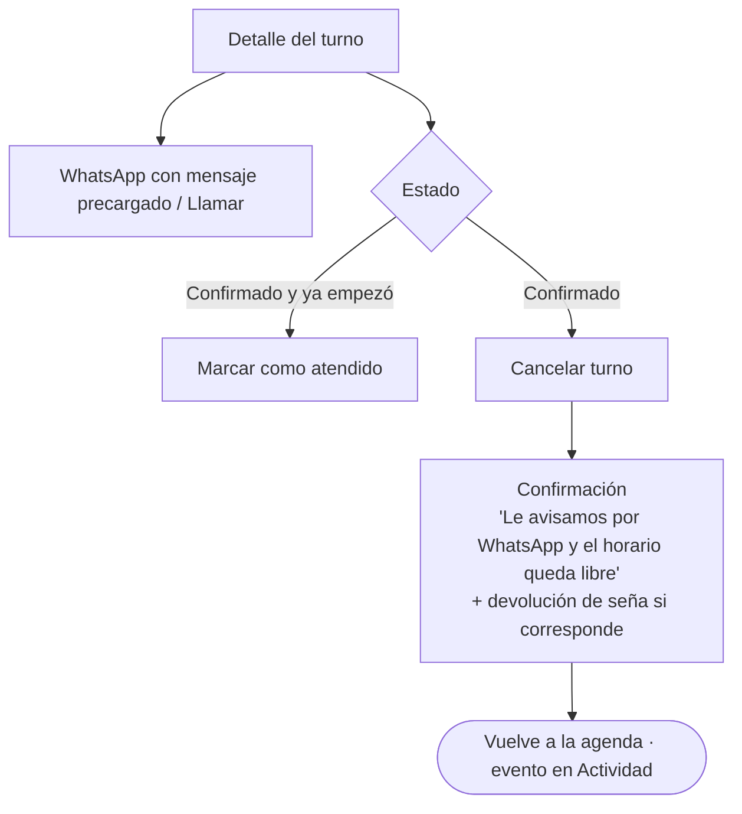

### 3. Marcar disponibilidad (franco, trámite, almuerzo)

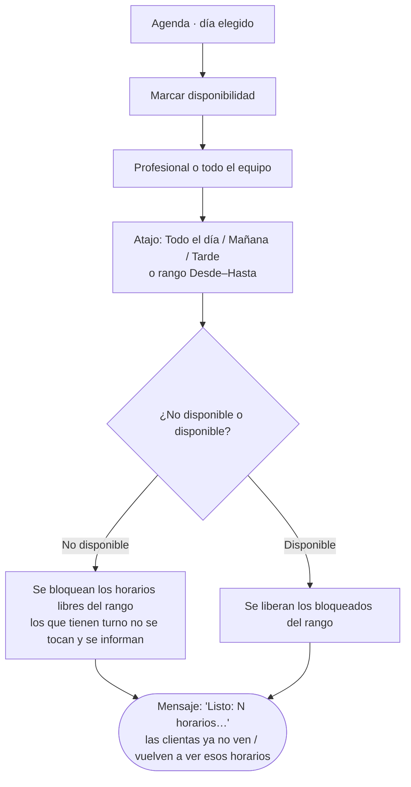

También se puede bloquear o liberar **un horario suelto** desde la vista por profesional.

### 4. Turno rápido (clienta en el local o por teléfono)

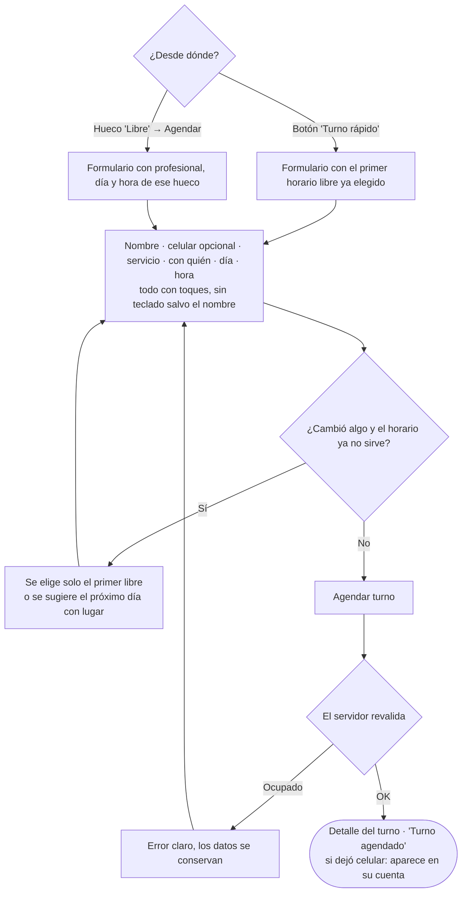

### 5. Enterarse de novedades

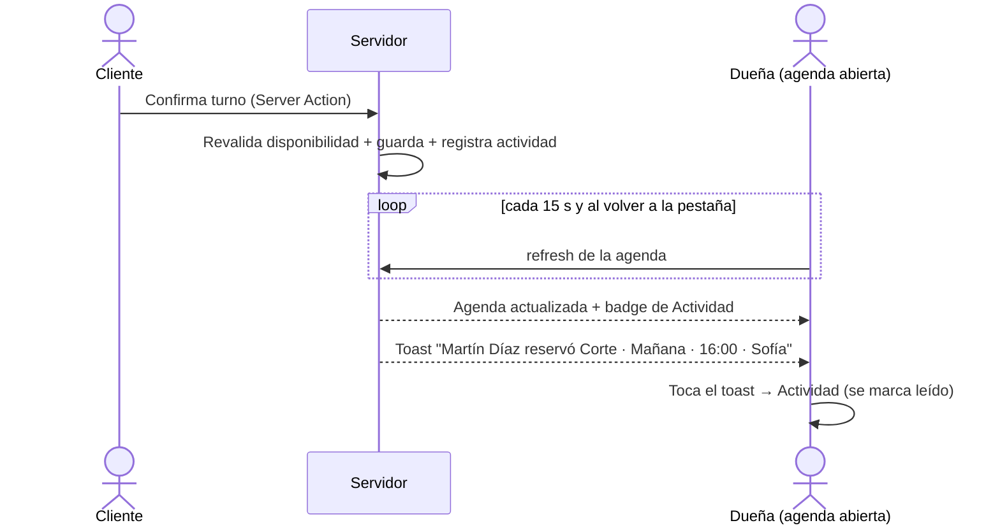

---

## Casos borde contemplados

| Caso                                      | Comportamiento                                                                                                                                              |
| ----------------------------------------- | ----------------------------------------------------------------------------------------------------------------------------------------------------------- |
| Dos clientes eligen el mismo horario      | La confirmación revalida dentro de una transacción; el segundo recibe un error claro y vuelve a elegir. En Postgres lo garantiza una restricción `EXCLUDE`. |
| Domingo                                   | Día deshabilitado: "Cerrado".                                                                                                                               |
| Servicio largo al final del día           | Solo se ofrecen horarios que terminan antes del cierre (sábado 14 h).                                                                                       |
| Horarios de hoy que ya pasaron            | No se ofrecen.                                                                                                                                              |
| "Cualquiera disponible"                   | Se asigna el primer profesional habilitado y libre; el resumen muestra a quién.                                                                             |
| Reprogramar                               | El turno propio no bloquea su mismo horario.                                                                                                                |
| Cancelar/cambiar con < 24 h               | No se permite online; se ofrece WhatsApp. Validado también en el servidor.                                                                                  |
| URL manipulada (servicio/fecha inválidos) | Los parámetros se validan con Zod y se redirige al paso correcto.                                                                                           |
| Bloquear un horario con turno             | El servidor lo rechaza.                                                                                                                                     |
